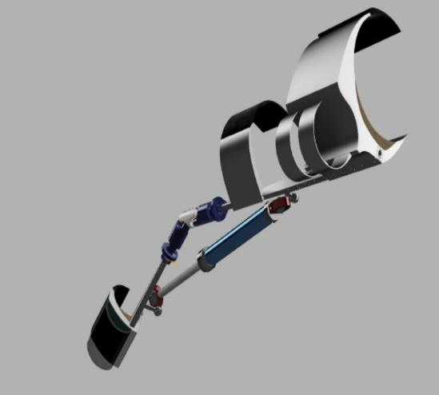
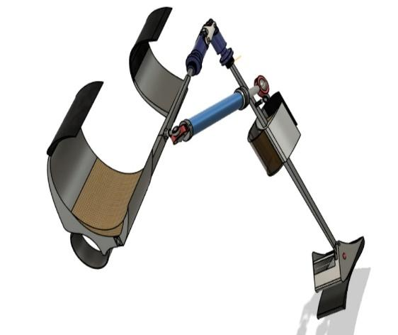
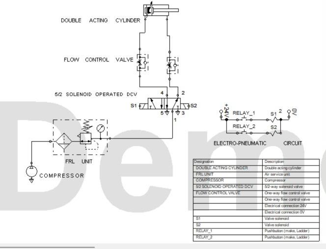
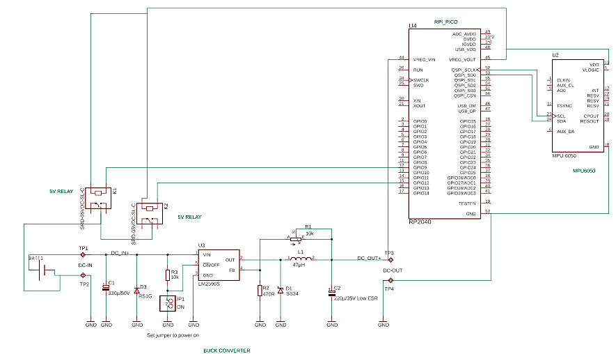
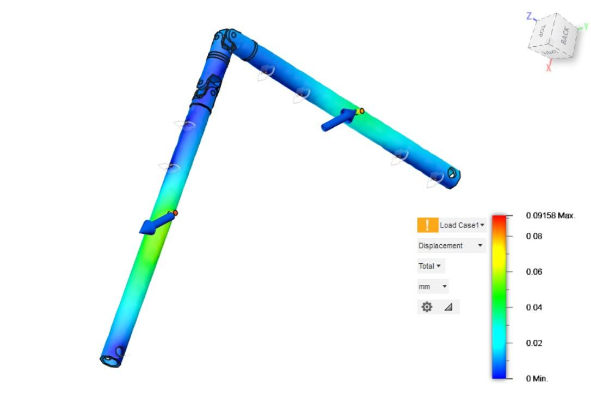
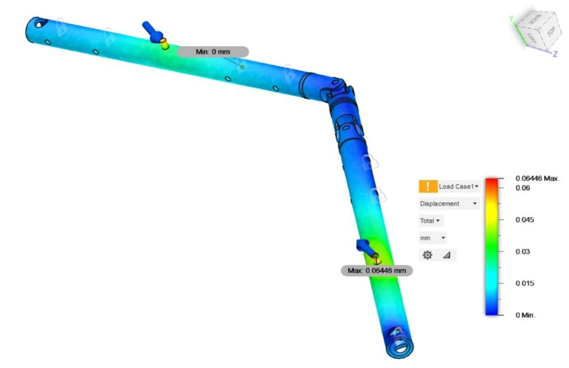

# Smart Knee Actuator

**Indian Patent Application No. 202341027059 — Published October 2024**  
KCG College of Technology, Chennai, India

> Wearable pneumatic lower-limb exoskeleton that reads knee load in real time via a MEMS IMU, runs a TinyML gait-phase classifier on an ARM Cortex-M0+ MCU, and actuates a pneumatic cylinder to provide adaptive assistive support — no manual input required.

---

## What It Does

Traditional knee braces are passive. This exoskeleton is active: it detects which phase of the gait cycle the patient is in (stance, swing, heel strike) and actuates pneumatic support precisely when needed, adapting dynamically to each individual's movement pattern. Target users: post-stroke and limb-paralyzed patients in rehabilitation.

---

## System Architecture

```
MPU6050 IMU (I2C, 3-axis accel + gyro)
Flex Sensor (joint angle)
        │
        ▼
RP2040 MCU (ARM Cortex-M0+, 133MHz, 264KB SRAM, 2MB Flash)
  ├─ TinyML gait-phase classifier (inference on 264KB SRAM)
  ├─ Relay control logic (2-channel relay, 10A @ DC 5V)
  └─ BLE module (mobile monitoring + emergency alerts)
        │
        ▼
5/2 Solenoid-Operated Directional Control Valve (DCV)
FRL Unit (Filter-Regulator-Lubricator) ← 10 bar compressor
        │
        ▼
Double-Acting Pneumatic Cylinder (ball joints both ends)
        │
        ▼
Double Universal Joint (2–6 DOF, carbon fiber skeleton)
        │
        ▼
Fiber-Reinforced Polymer Composite Prosthetic Foot
```

---

## Key Specifications

| Parameter | Value |
|-----------|-------|
| MCU | RP2040, dual-core ARM Cortex-M0+, 133MHz |
| SRAM / Flash | 264KB SRAM, 2MB Flash |
| GPIO / Peripherals | 26 GPIO, 2×SPI/I2C/UART, 3×12-bit ADC, 16×PWM, 8 PIO state machines |
| IMU | MPU6050 (I2C), 3-axis MEMS accelerometer + gyroscope |
| Relay | 2-channel, rated 10A at DC 5V |
| Pneumatic pressure | 10 bar compressor with FRL unit |
| Actuator | Double-acting cylinder, ball joints both ends |
| DOF range | 2–6 degrees of freedom, adjustable per recovery stage |
| FEA validation | 500N applied load (extension + flexion phases) — structure passed |
| Safety margin | 60kg patient requires <300N — design provides 67% overhead |
| Power | Li-Po battery + custom buck converter |
| Wireless | BLE module for mobile app (patient monitoring + emergency alerts) |
| Prototype | Additive manufacturing |

---

## Patent Claims

1. Pneumatic actuation system: double-acting cylinder + portable compressor + FRL unit + flow control valves + solenoid DCV
2. 2-DOF double universal joint mechanism
3. Ball joints on both ends of pneumatic cylinder
4. Flex sensor + gyroscope/accelerometer for gait coordination
5. MCU running TinyML from real-time sensor data for relay control
6. BLE module for mobile data monitoring
7. Mobile app with emergency medical center alerts
8. Height adjustment via spring-based mechanism
9. Three-brace Velcro fit system
10. Footplate with load distribution strap

---

## Technical Highlights

**TinyML on 264KB SRAM:** The gait classifier runs entirely on the RP2040's 264KB SRAM — no external compute, no cloud dependency. Real-time inference from IMU + flex sensor data at the edge.

**Closed-loop gait adaptation:** The system reads sensor data, classifies gait phase, and actuates the pneumatic cylinder within the same control loop — adapting support dynamically as the patient walks.

**FEA-validated safety margin:** Structural simulation at 500N confirmed the carbon fiber skeleton and joint design exceed the 300N force required for a 60kg patient by 67%.

**Variable DOF:** The double universal joint supports 2–6 DOF, allowing clinicians to lock or unlock degrees of freedom as the patient progresses through rehabilitation stages.

---

## Hardware Stack

- **MCU:** RP2040 (Raspberry Pi Foundation)
- **IMU:** MPU6050 (InvenSense) via I2C
- **Flex sensor:** Resistive bend sensor for joint angle feedback
- **Relay:** 2-channel relay module (10A @ DC 5V)
- **Valve:** 5/2 solenoid-operated directional control valve
- **Cylinder:** Double-acting pneumatic cylinder
- **Joint:** Double universal joint (2–6 DOF)
- **Skeleton:** Carbon fiber structural frame
- **Foot:** Fiber-reinforced polymer composite
- **Power:** Li-Po battery + buck converter circuit
- **Comms:** BLE module

---

## Relevance to Engineering Roles

| Role | What this demonstrates |
|------|----------------------|
| Embedded Software | RP2040 bare-metal C/C++, TinyML deployment, I2C sensor integration, PWM relay control, GPIO |
| Firmware | Real-time sensor fusion, state machine control, interrupt-driven event handling |
| Robotics | Closed-loop gait-adaptive control, pneumatic actuation system, exoskeleton kinematics |
| Edge AI | TinyML inference on 264KB SRAM Cortex-M0+, real-time gait phase classification |
| Medical Devices | FEA validation, safety margin analysis, assistive rehabilitation device |
| Controls | Feedback control loop, actuator selection, force analysis |

---

## Patent Information

- **Application Number:** 202341027059
- **Issue Date:** October 18, 2024
- **Applicant:** KCG College of Technology
- **Filed:** April 6, 2023
- **Field:** Robotics / Assistive Technology / Embedded Systems

---

---

## Patent Figures








---

*Built as part of undergraduate research at KCG College of Technology, Department of Electrical and Electronics Engineering.*
